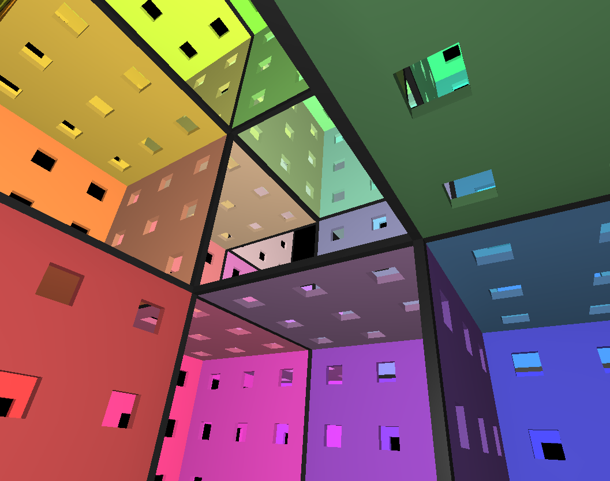

# 3D Maze
A fully three-dimensional maze in first person, built with [Three.js](https://threejs.org/).

# [Click here to play!](https://www.chrisraff.com/3d-maze)

[](https://www.chrisraff.com/3d-maze)

## Gameplay

Navigate a randomly generated 3D maze and find the exit. The maze is truly three-dimensional — corridors can go up and down, not just left and right. A compass in the corner always points toward the exit to help you orient yourself.

When you complete a maze, your time and maze size are displayed. You can then start a new maze from the pause menu.

## Features

- **Adjustable maze size** — choose a size from 2 to 12 via the "Choose Maze Size" menu
- **3D navigation** — move through corridors in all six directions, including up and down
- **Compass** — always points toward the exit
- **VR support** — play in WebXR with controller or gaze-based controls; supports teleport and smooth movement modes
- **Mobile support** — dual-stick touch controls; works as a PWA (add to home screen)
- **Fixed camera option** — toggle in Options to lock vertical camera rotation

## Controls

| Platform | Move | Look |
|---|---|---|
| Desktop | WASD | Mouse |
| Mobile | Left side drag | Right side drag |
| VR (controllers) | Left thumbstick | Right thumbstick |
| VR (gaze) | Tap | Head direction |

Press **Escape** (or **P** on Mac) to pause. In VR, press either thumbstick to pause.

## Running Locally

This project uses ES modules and loads 3D models, so it must be served over HTTP — opening `index.html` directly will fail due to CORS restrictions.

The easiest way is with Python's built-in server:

```bash
python -m http.server
```

Then open [localhost:8000](http://localhost:8000) in your browser.

Any static file server works — `npx serve`, `live-server`, nginx, etc.
